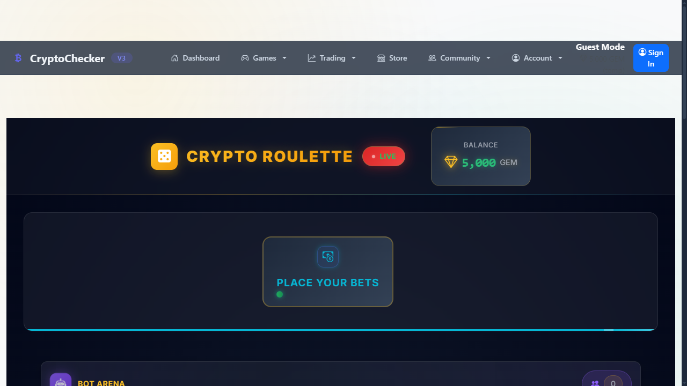
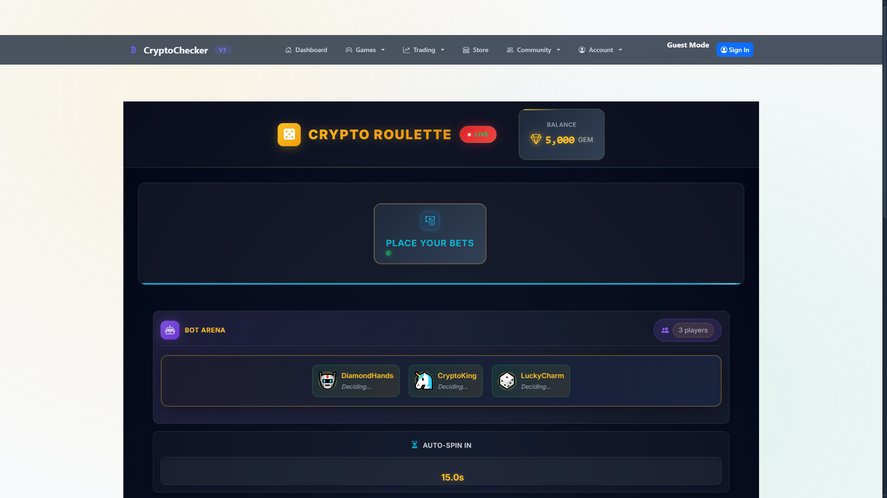
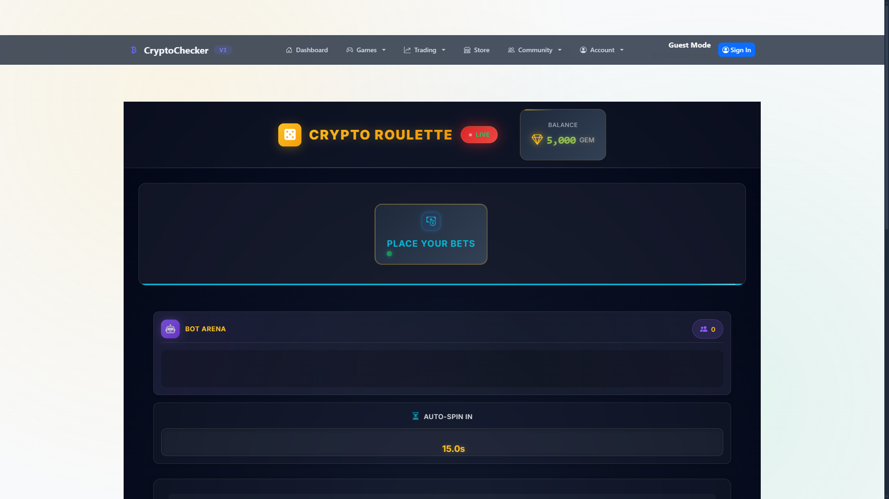

# 🎰 CryptoChecker V3

**Professional Real-Time Cryptocurrency Tracking & Gaming Platform**



## 📋 Overview

**CryptoChecker** is a sophisticated, full-stack web application that combines real-time cryptocurrency financial data with an engaging, provably fair gaming experience. Built with performance and scalability in mind, it demonstrates complex state management, secure authentication, and infinite-scale architecture.

This project showcases a production-ready implementation of a "Crypto Casino" style platform where users can track live markets and usage their virtual portfolio to play games like Roulette.

## ✨ Key Features

### 🚀 Real-Time Market Data
- **Live Price Tracking**: Real-time integration with crypto APIs (CoinGecko/CoinCap) for 50+ cryptocurrencies.
- **Universal Converter**: Instant currency conversion between crypto-to-crypto, crypto-to-fiat, and fiat-to-fiat pairs.
- **Portfolio Management**: Persistent user portfolios with transaction history and performance metrics.

### 🎮 Professional Gaming Engine
- **Crypto Roulette**: A fully featured, Cstrike.bet-inspired roulette game.
- **Provably Fair Logic**: SHA256-based verification system ensuring transparent and fair game results.
- **Advanced State Management**: Custom JavaScript engine handling complex betting phases (Betting → Spinning → Results → Cleanup).
- **Rich UI/UX**: Canvas-based animations, particle effects, and sound engineering for an immersive experience.

### 🛡️ Enterprise-Grade Architecture
- **Secure Authentication**: JWT-based stateless authentication with session management.
- **Robust Backend**: FastAPI (Python) providing high-performance, async API endpoints.
- **Database Scalability**: Designed with SQLAlchemy ORM, production-ready for PostgreSQL.
- **Clean Code Principles**: Modular architecture separating concerns (API, Services, Database, Frontend).

## 🛠️ Technology Stack

| Component | Technologies |
|-----------|--------------|
| **Backend** | Python 3.9+, FastAPI, SQLAlchemy, Pydantic, AsyncIO |
| **Frontend** | HTML5, CSS3 (Custom Properties), Vanilla JavaScript (ES6+), Jinja2 |
| **Database** | SQLite (Dev) / PostgreSQL (Prod), Alembic Migrations |
| **Security** | JWT, BCrypt, Environment Configuration |
| **Tools** | Git, Pytest, Virtualenv |

## 📸 visual Showcase

| **Interactive Gaming** | **Live Dashboard** |
|:---:|:---:|
|  |  |
| *Immersive roulette with bet management* | *Real-time crypto prices and stats* |

## 🚀 Getting Started

Follow these instructions to set up the project locally for review.

### Prerequisites
- Python 3.9 or higher
- Git

### Installation

1. **Clone the repository**
   ```bash
   git clone https://github.com/yourusername/CryptoChecker.git
   cd CryptoChecker/PythonCryptoChecker
   ```

2. **Create and Activate Virtual Environment**
   ```bash
   # Windows
   python -m venv .venv
   .venv\Scripts\activate

   # Linux/macOS
   python3 -m venv .venv
   source .venv/bin/activate
   ```

3. **Install Dependencies**
   ```bash
   pip install -r requirements.txt
   ```

4. **Run the Application**
   ```bash
   # Ensure you are in the PythonCryptoChecker directory
   python main.py
   ```

5. **Access the App**
   Open your browser and navigate to: [http://localhost:8000](http://localhost:8000)

## 📄 License

This project is open source and available under the [MIT License](LICENSE).

---
*Built by [Your Name] - 2025*
